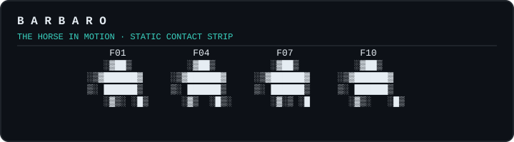

# Barbaro

<p align="center">
  
</p>

Barbaro is a deterministic, project-local coordination layer for coding agents.
It reads Codex and Claude Code session JSONL without modifying the provider
trace, then materializes three small views:

- `.barbaro/feed/`: completed human-turn digests for default peer context.
- `.barbaro/evidence/`: supporting facts loaded only when needed.
- `.barbaro/active/`: expiring advisory snapshots of work in progress.

There is no token or word limit on the source trace and Barbaro never redacts,
truncates, rewrites, or deletes it. Only derived copies may be byte-bounded or
redacted, and those changes are recorded explicitly with fidelity, byte-count,
redaction, and source-reference metadata.

## Current status

| Area | Status |
|---|---|
| Shared `barbaro.turn.v1`, `barbaro.evidence.v1`, and `barbaro.active.v1` contracts | Implemented |
| Codex Desktop legacy and paginated JSONL parser, runner, checkpoint/resume, action projection, and hooks | Implemented and fixture-tested against legacy `0.148.0-alpha.9` and paginated `0.149.0-alpha.4.1` rollouts |
| Claude Code empirical schema, mapping, and sanitized fixtures | Implemented |
| Claude Code parser, bundle runner, active-branch and fork handling, subagent/workflow lineage, Stop/`turn_duration` closure, background continuations, and hooks | Implemented and sanitized-fixture-tested |
| Live coordination: scoped `barbaro context`, echo-suppressed `barbaro watch`, cursor-aware `barbaro await`, hook nudges, and `/barbaro-watch` | Implemented |
| Workstreams: two-phase enrollment, forward membership moves, timestamp-stamped records (`docs/workstreams.md`) | Enrollment, moves, scoped context, waits, and wake-ups implemented |
| Comfort TUI: Open/Completed Home, Working/Waiting/Blocked activity, explicit create/complete/reopen controls, response ledger, provenance styling, bounded snapshots, and Muybridge motion study | Implemented and fixture-tested |
| Codex missing-start synthesis, lease-expiry abandonment, and `.jsonl.zst` input | Not implemented: missing starts are diagnosed, open turns remain private after lease expiry, and `.jsonl.zst` is rejected explicitly |

The raw Codex envelope is version-pinned but forward-tolerant: unknown record
types and fields are diagnosed without inventing shared semantics. The current
runner targets uncompressed legacy and paginated rollouts.

### Platform availability

Codex Desktop is Barbaro's first-class Codex environment because the adapter
reads rollout files present on the local machine. A Codex session running only
on iOS or in the cloud is not visible to Barbaro until that session's rollout
lands locally. Barbaro does not provide or assume cross-device rollout sync.

## Install

The canonical installation guide is [`INSTALL.md`](INSTALL.md). Barbaro requires
Node.js 22 or newer; install the published CLI from the npm registry first:

```sh
npm install --global barbaro
barbaro --version
```

If the registry is unavailable, the secondary path in [`INSTALL.md`](INSTALL.md)
downloads the GitHub prerelease assets `barbaro-0.1.0-alpha.3.tgz` and its
separate `barbaro-0.1.0-alpha.3.tgz.sha256` checksum, verifies the archive, and
installs that built tarball. The `github:d4j3y2k/barbaro#<tag>` source-install
form is intentionally unsupported; source tags do not contain the built CLI.

Before enabling hooks, read the [public-alpha limitations](ALPHA.md) and
[security policy](SECURITY.md). Checkout-backed development is a
maintainer-only workflow documented separately below and in [`INSTALL.md`](INSTALL.md).

## Cowork quickstart: Codex builder + Claude reviewer

After completing [`INSTALL.md`](INSTALL.md) and ignoring `.barbaro/`, choose a
fresh lowercase slug and create one workstream without enrolling either session:

```sh
barbaro workstream new alpha-demo \
  --title "Alpha demo" \
  --project-root "$PWD"
barbaro workstream list --project-root "$PWD"
```

In Codex Desktop, switch the composer to Goal mode, select **Barbaro**, and
submit a leading prompt like this to enroll the builder:

```text
$barbaro join alpha-demo Build the agreed change. Begin with PLAN REQUEST v1 and edit nothing before PLAN APPROVED.
```

Goal mode belongs to Codex, not Barbaro; it is not a `barbaro goal` CLI
command. In each later goal iteration that is waiting for review, the builder
runs exactly one cursor observer:

```sh
barbaro await \
  --provider codex \
  --session-id "$CODEX_SESSION_ID" \
  --project-root "$PWD"
```

If that tool execution yields, resume the same execution; do not launch a
replacement await in the iteration. When it returns—whether for unread work or
a timeout—run exactly one context read, inspect the returned context, act if
warranted, and end the turn:

```sh
barbaro context \
  --provider codex \
  --session-id "$CODEX_SESSION_ID" \
  --project-root "$PWD"
```

A pending review is `WAITING`, never `BLOCKED`. `await` observes the cursor but
does not acknowledge it; the context read acknowledges and shows the peer turn.

In a separate Claude Code session, enroll the read-only reviewer, then arm its
provider-native watcher in a second prompt:

```text
/barbaro join alpha-demo Review only. Answer gated requests keyword-first, with no preamble.
```

```text
/barbaro-watch
```

The builder and reviewer communicate through completed turns. The builder's
gated messages begin with:

```text
PLAN REQUEST v1: <scope, files, verification, and proposed checkpoints>
CHECKPOINT 1: <what changed, commit SHA, and how to verify>
DONE: <commits and tag>
```

The reviewer's verdict turn must begin at byte zero with one of:

```text
PLAN APPROVED
PLAN REVISE: <required changes>
CHECKPOINT 1 APPROVED
CHECKPOINT 1 REVISE: <required changes>
```

No heading, greeting, or status line comes before the verdict keyword. A turn
that does not begin with one of those verdict forms—including a person's
sideline direction—is context or instruction, not approval for the next gate.

## Maintainer-only checkout development

This checkout-backed workflow is for Barbaro maintainers, not normal users or
persistent hook installations:

```sh
npm ci
npm run typecheck
npm test
npm run build
npm link
```

Normal users should install the registry package or verified release tarball as
described in [`INSTALL.md`](INSTALL.md); `npm link` deliberately points the
global command back into this development checkout.

Run a one-off Codex ingest:

```sh
node dist/src/cli.js codex ingest \
  --trace /absolute/path/to/rollout.jsonl \
  --project-root /absolute/path/to/project
```

The first run reads all complete lines. Later runs resume from a byte-accurate
checkpoint and do not duplicate stable records. A partial final JSONL line is
left unconsumed until the provider completes it.

## Use the comfort terminal

Run the live comfort TUI from any Barbaro project:

```sh
barbaro tui
```

With motion enabled at 64×28, startup holds the title for at least one complete
11-plate branded stride while the first bounded read settles. The 56×22 title
uses compact riderless plates. The 40×12 tier stays art-free while preserving
separate Working, Waiting, and Blocked counts; 12×6 is the art-free minimum
status tier.

The TUI centers one fixed comfort card in the terminal. Home starts in the Open
view: every open workstream has a selectable row, ordered by its newest known
activity, while completed workstreams stay out of the default activity surface.
Press `/` to switch to the Completed view, where completed workstreams remain
discoverable and can be reopened. The frame reports both populations honestly,
for example `1 of 2 open · 10 completed`, rather than silently shrinking the
catalogue. Incomplete evidence stays named instead of looking idle.

When sessions in open workstreams have unread peer turns, the Home truth strip
cycles through each recipient on successful refreshes using
workstream/provider labels. Completed workstreams do not contribute to this News
carousel or its activity counts. A recipient without a live lease shows its
last proven exposure age or `activity unknown`; the TUI never guesses that it
is dead. `--no-motion` and `--once` hold the first entry still. Exact ticker
counts appear only when recipient evidence is complete.

Only shown Working activity gallops in steady state. Space pauses and resumes
it; interactive `--no-motion` replaces the horse with `Working · motion off`
while data refreshes continue. A working `--once` snapshot uses the exact,
ordered F01/F04/F07/F10 contact strip instead of choosing a clock frame:

<p align="center">
  
</p>

When nothing shown is working, the scoped card becomes a response-first ledger
of recent completed exposures, ordered oldest to newest. It prefers response
excerpts, marks non-success outcomes, and keeps the newest-exposure `>` cursor
independent from session selection. `j`/`k` accents the selected session's
exposure and roll rows in cyan while other-session rows recede; `--no-color`,
`NO_COLOR`, and `--once` remain plain. Excerpts never scroll or become a
ticker—the selected session's fixed bench carries its detail. Larger terminals
add empty matte rather than more records; smaller terminals step through
64×28, 56×22, 40×12, and 12×6 card tiers.

With no scope flag the TUI reads the project catalogue and opens on
`Home · Open`. `--all-workstreams` requests that same project scope explicitly,
while `--workstream <name|id>` opens directly on one resolved workstream,
including a completed one. Reads remain bounded by the byte and turn-window
options, and every projection reports what was shown or hidden.

On Home, use `j`/`k` or the arrow keys to select a workstream, Enter to open it,
`/` to switch between Open and Completed, and `n` to open the create form.
Press `x` to complete an open workstream or reopen a completed one; the TUI asks
for explicit, evidence-pinned confirmation before either change. Enter confirms
and Escape refuses. Completing is a reversible status statement and does not
stop enrolled or currently active sessions. Inside a scoped workstream, `j`/`k`
selects the session whose provenance is accented. Use `r` to refresh, `?` for
help, Escape to return, and `q` or Ctrl-C to exit. Space pauses and resumes a
visible gallop; under `--no-motion` it deliberately does nothing.

The create form accepts a lowercase slug and an optional title. Tab and
Shift-Tab move between fields, Backspace edits, Ctrl-S creates, and Escape
cancels. Creation calls the public `barbaro workstream new` command, then
reconciles the result before reporting success. It enrolls no session. After a
successful create, `j`/`k` selects the Claude Code or Codex join command and
`c` performs Punch Out: it copies that exact command when a supported clipboard
path is available, or leaves it highlighted for manual copying. Punch Out does
not run the join command. Confirmed lifecycle changes likewise call the public
`barbaro workstream complete` or `barbaro workstream reopen` command and reread
the catalogue before reporting their result.

Supported options:

```sh
barbaro tui --project-root /absolute/path/to/project --interval-ms 2000
barbaro tui --byte-budget 32768 --turns-per-session 8
barbaro tui --workstream tui-design
barbaro tui --all-workstreams
barbaro tui --no-color --no-motion
barbaro tui --once --width 120 --height 32
```

`--once` writes one plain, non-ANSI snapshot and never takes terminal,
clipboard, animation, or lifecycle-action ownership. An unscoped snapshot
captures the default Open view and labels itself `Home · Open · snapshot`;
`--workstream <name|id>` can still capture a completed workstream directly. A
bare snapshot is exactly 64×28. Explicit `--width` and `--height` are accepted
only with `--once`; larger requests center the same card in matte, and a request
below the 12×6 floor receives a true-size notice at the dimensions actually
requested. `--no-color` and the `NO_COLOR` environment variable disable
styling; `--no-motion` stops animation without stopping data refreshes.

<p align="center">
  
</p>

Interactive mode refuses `TERM=dumb` or an unset `TERM` before emitting terminal
control bytes and points to `--once` instead. A capable `TERM` is not enough on
its own: stdin and stdout must also be attached to a TTY. Navigation, help,
refresh, filtering, and `--once` are read-only. The interactive TUI changes
project state only after an explicit create submission or complete/reopen
confirmation, and does so through the matching public `barbaro workstream` CLI
command before reconciling the reader result. Punch Out changes the clipboard
only after an explicit `c`. The TUI never edits provider traces directly.

### Preview the horse motion study

The visual study adapts Eadweard Muybridge's public-domain 1878 *Sallie Gardner
at a Gallop* frames into precomputed `█▓▒░` terminal shading. It remains the
standalone provenance and comparison tool for the riderless dashboard art:

```sh
npm --prefix "$(npm root --global)/barbaro" run study:horse
```

The preview opens as a compact side-by-side comparison: the unaltered source is
on the left and a per-frame, source-masked riderless derivative is on the
right. Press Space to pause, use the left and right arrows to inspect individual
plates, press `s` to switch between hero and compact scales, `v` to cycle the
original, riderless, and comparison views, `w` to cycle the body-wordmark
on or off, and `q` to exit. For a noninteractive frame:

```sh
npm --prefix "$(npm root --global)/barbaro" run study:horse -- \
  --once --frame 3 --scale compact --variant compare
```

Maintainers working from a built checkout may use `npm run study:horse`
directly instead.

Use `--wordmark none|spaced-lower` to select the body wordmark directly.

The generated frame source records its public-domain provenance and SHA-256.
Rider removal is stored as per-frame source-pixel mask data in the generator,
never as hand-edited terminal glyphs. The original shaded treatment is retained
across the horse, including the top of the head; only the forward/lower face
contour uses source-space half-block detail to preserve the muzzle at compact scale.
Regeneration is an optional development task requiring Python and Pillow; it is
not a runtime dependency of Barbaro.

The checked-in README visuals are regenerated from those same TUI frames,
contact-strip rows, and snapshot fixture without generator-time font or
image-tool dependencies:

```sh
npm run docs:assets
npm run docs:assets:check
```

## Watch peer activity

Stream peer events — completed turns, joins, incidents, stale leases — as
they happen:

```sh
barbaro watch \
  --project-root /absolute/path/to/project \
  --provider claude --session-id "$CLAUDE_CODE_SESSION_ID"
```

`--json` emits one `barbaro.watch.event.v1` object per line for tooling;
omit `--provider`/`--session-id` to observe without excluding a session, or
pass `--once` for a single poll after the baseline. Turns caused by a
watcher's own wake-ups are suppressed by their provenance stamp, so two
watching sessions can never wake each other forever.

When the watching session belongs to a workstream, the stream is scoped to
it: turns, joins, and stale leases from other workstreams — and from sessions
that joined before workstreams existed — are not delivered, and the `TURN`,
`JOIN`, and `STALE` lines carry `ws=`. `--workstream <name|id>` scopes an
observer explicitly and `--all-workstreams` watches the whole project.
`barbaro context` accepts the same three flags and reports `workstream_id`
when scoped.

For a one-shot, Codex-friendly wait on unread peer turns, run:

```sh
barbaro await \
  --project-root "$PWD" \
  --provider codex --session-id "$CODEX_SESSION_ID"
```

`await` observes the joined session's hook-owned unread cursor. It returns
immediately when peer turns are already unread; otherwise it blocks until an
unread turn appears or the bounded timeout expires. Every peer turn counts,
including a response published from a Monitor wake. The command is read-only:
run `barbaro context` to acknowledge and inspect the turns before reacting,
and concurrent waits for the same session cannot consume or hide one another's
result.

Identify the waiting session with paired `--provider`/`--session-id` flags or
its stable `--self <ses_id>` identity. Await refuses identity-less,
all-workstream, and foreign-workstream reads; its cursor always belongs to the
session's current workstream. The default timeout is 600000 ms and the hard
cap is 3600000 ms. A timeout remains a successful result.

## Enable Codex live coordination

Complete the package, skill, and hook steps in [`INSTALL.md`](INSTALL.md), then
restart Codex if the skill does not appear and review the installed user hook
definitions with `/hooks`.

User-scoped hooks remain dormant in every repository until the user explicitly
joins a particular session. The `.barbaro/` store remains isolated under that
session's working project.

For a project-local installation instead, add this exact entry to the target
project's own `.gitignore`:

```gitignore
.barbaro/
```

Barbaro does not alter `.gitignore` automatically. Feed and evidence may contain
sensitive request/response excerpts, so verify the target project ignores this
directory before enabling hooks.

Installed hooks are dormant until the user explicitly joins each session to a
**workstream** — the group of Codex and Claude sessions sharing one objective
in the project. Provider-native skills supply the join action:

- In Claude Code, invoke `/barbaro new <name>` or `/barbaro join <name>`.
- In Codex, choose **Barbaro** from the composer's slash menu or invoke the
  `$barbaro` skill directly, followed by `new <name>` or `join <name>`. Codex
  reserves bare slash-command names, so the inserted prompt token is
  `$barbaro`.

`new` creates the workstream and joins it; `join` joins an existing open one.
A bare invocation — `/barbaro` alone, or followed by anything other than
`new`/`join` — enrolls nothing: it lists the open workstreams so the user can
pick or create one, and the skill holds any task text until they do. The same
prompt can include the first task. For example:

```text
/barbaro join tui-design Refactor the session writer.
```

Workstream names are lowercase slugs such as `tui-design`, unique within the
project. A session belongs to one workstream at a time and may move forward to
another open one with `new` or `join`; earlier turns stay in the workstream
that was current when they happened. `barbaro workstream list` shows the open
workstreams and `barbaro workstream new <name>` creates one without joining.
Turns and evidence are stamped from the session's append-only membership log
using their own timestamps, while leases carry the current `workstream_id`.

The match is deliberately narrow: the provider-native command or skill token
must lead the submitted prompt. Mentioning `/barbaro` or `$barbaro` elsewhere
does not opt in. When Barbaro is selected in Codex Desktop, Codex serializes
the leading token as a Markdown skill attachment. Barbaro accepts it only when
its destination resolves exactly to the current project's skill or the
user-wide `$HOME/.agents/skills/barbaro/SKILL.md`; arbitrary Markdown links do
not opt in.
Consent is scoped to the provider's native session ID.
Resuming that session stays joined; a new Codex or Claude session starts
dormant and must be joined separately. Before invocation, hooks do not publish
active leases or ingest transcript copies. Explicit one-off
`barbaro <provider> ingest` commands are unaffected.

Check enrollment without changing it:

```sh
barbaro codex status --session-id "$CODEX_SESSION_ID" --project-root "$PWD"
```

The result reports the derived Barbaro session key, join status, current
workstream, and `memberships` history. `unscoped: true` marks a session that
joined before workstreams existed and has not moved yet. For Codex, use
`CODEX_SESSION_ID`; `CODEX_THREAD_ID` can name a subagent's physical rollout
rather than the owning provider session.

Consent stays with the whole provider session, but each membership begins at
its recorded `from` time. If Barbaro is invoked after earlier turns completed,
a catch-up ingest leaves those records unscoped; moving later likewise leaves
earlier records in their original workstream. Reset re-ingest makes the same
decision from each record's own timestamp.

For a joined session, the hook adapter keeps `.barbaro/active/` current during
prompts and tool use, then ingests completed root and subagent transcripts.
Codex persists
`task_complete` only after synchronous Stop hooks return, so the example uses
two handlers for terminal events: a synchronous `barbaro codex hook` writes the
idle tombstone, while an ingest-only `barbaro codex hook-ingest` runs in the
background and polls for that exact terminal turn. User-prompt and session-end
catch-up cover interrupted workers.

For a project-local installation, merge the event entries from
[`examples/codex-hooks.json`](examples/codex-hooks.json) into the target
project's `.codex/hooks.json`. Do not overwrite an existing hook file blindly.
Codex must trust the project and the user must approve its startup hook review
before project-local hooks run. Keep the active handler synchronous and the
Stop/SubagentStop ingest handler asynchronous as shown; making terminal
ingestion synchronous prevents Codex from writing the record it is waiting
for.

Whether hooks are user- or project-scoped, they still require the per-session
command. Installing Barbaro must not silently enroll work in another project.

## Enable Claude Code live coordination

Complete the package, skill, and hook steps in [`INSTALL.md`](INSTALL.md), then
restart Claude Code if its top-level user skills directory did not exist when
the session started. Verify `/barbaro` and `/barbaro-watch` appear in `/skills`
and the installed handlers appear in `/hooks`.

The activity handlers are short and synchronous; ingest handlers run
asynchronously except for the bounded SessionEnd fallback. SubagentStop
ingestion polls until the parent trace records the correlated completion, so
canonical output remains trace-derived rather than trusting hook timing. The
`/barbaro` skill disables model-initiated invocation. After joining, invoke
`/barbaro-watch` to arm peer wake-ups, or `/barbaro-watch off` to disarm them.

Project-scoped installs may use `.claude/skills/` and
`.claude/settings.json` instead, but do not register both user-wide and
project-local copies of the hooks: matching handlers from both scopes would
run twice.

The canonical feed and evidence stay complete. A busy turn can still be large;
peer readers must apply an explicit byte-budgeted projection and report N-of-M
actions rather than silently dropping canonical actions. That reader projection
is separate from—and never edits—the provider trace or stored canonical JSONL.

## Design references

- [`spec/barbaro-v1.md`](spec/barbaro-v1.md): normative shared contract.
- [`docs/codex-jsonl-mapping.md`](docs/codex-jsonl-mapping.md): authoritative
  Codex source mapping and durability policy.
- [`docs/claude-code-jsonl-schema.md`](docs/claude-code-jsonl-schema.md):
  empirical Claude Code source schema.
- [`docs/claude-to-barbaro-v1.md`](docs/claude-to-barbaro-v1.md): Claude Code
  normalization mapping.
- [`docs/workstreams.md`](docs/workstreams.md): the workstream model, its
  invariants, and the phased rollout.

This repository ignores its own `.barbaro/`; every target project must make the
same explicit choice. Treat it as sensitive local derived data unless the
project deliberately publishes it.
