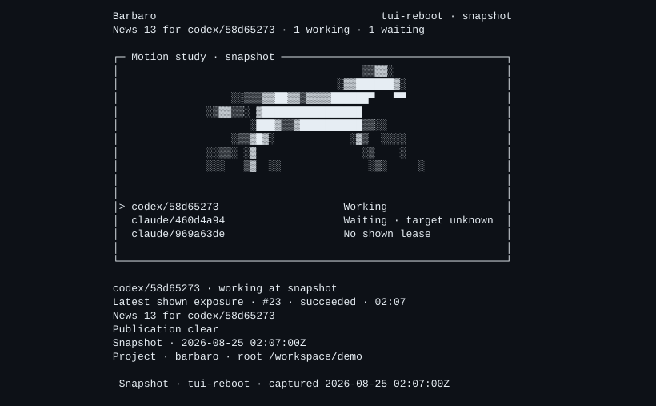

# Barbaro

Barbaro is local coordination for Codex and Claude Code sessions working in
the same checkout. Enrolled sessions share completed turns, recent actions,
and advisory file claims without modifying either provider's session logs.
Related sessions join a named **workstream**, which scopes their routine
context and wake-ups to one objective.

Barbaro does not launch agents, stream in-progress model output, lock files,
replace Git or worktree isolation, or sync across devices. It has no runtime
server or network service: hooks write derived records under `.barbaro/`, and
the CLI and terminal dashboard read them.

<p align="center">
  
</p>

> [!WARNING]
> Barbaro is a public alpha for trusted local development machines. It requires
> Node.js 22 or newer, is tested on macOS and Linux, and currently coordinates
> only sessions using the **same checkout and project root**. Derived
> `.barbaro/` records may contain prompt, response, tool, path, and failure
> details; ignore that directory before enabling hooks. Read the
> [alpha limitations](ALPHA.md) and [security policy](SECURITY.md).

## How it works

```text
Codex Desktop rollout ─┐
                       ├─ read-only hooks/ingest ─> .barbaro/ ─> TUI
Claude Code trace ─────┘                                  ├─> context
                                                         ├─> watch
                                                         └─> await
```

- A workstream is a named objective shared by one or more sessions. It can
  contain Codex sessions, Claude Code sessions, or both.
- Sessions opt in individually. Installing Barbaro does not enroll anything,
  and a new provider session starts dormant.
- Peers receive completed turns and bounded context, never a live partial
  transcript. The original provider trace remains untouched.
- Active file claims and Working/Waiting/Blocked states are advisory signals,
  not locks or proof that a process is alive.

## Install

The npm package is the canonical installation path:

```sh
npm install --global barbaro
barbaro --version
```

Then install the provider skills and hooks using [`INSTALL.md`](INSTALL.md).
That guide covers user-wide and project-local setup, the verified GitHub
release fallback, and the required `.barbaro/` ignore rule. Choose one setup
scope per provider; do not register the same hooks at both user and project
scope.

## Quick start

Complete the skill and hook setup in [`INSTALL.md`](INSTALL.md), then open both
provider sessions in the same checkout. In Codex Desktop, create and join a
workstream with a leading Barbaro skill invocation:

```text
$barbaro new docs-refresh Update the public documentation.
```

Join that workstream from Claude Code:

```text
/barbaro join docs-refresh Review the documentation for accuracy.
```

The providers can be reversed, and a workstream may contain multiple sessions
from the same provider. A bare `$barbaro` or `/barbaro` lists available
workstreams and joins nothing.

From the project root, open the dashboard:

```sh
barbaro tui
```

Each completed provider turn becomes available to its peers. No Goal mode,
watcher, or approval protocol is required. Claude Code users can optionally
run `/barbaro-watch` to wake that session when peer activity arrives. See the
[usage guide](docs/usage.md) for context reads, waits, event streams, and
scoping, or the [optional gated-review workflow](docs/gated-review.md) when a
builder really does need explicit approvals.

## Terminal dashboard

<p align="center">
  
</p>

`barbaro tui` shows open and completed workstreams, recent completed-turn
excerpts, and the sessions currently reporting Working, Waiting, or Blocked.
Run it from the project root or pass `--project-root` explicitly.

The primary controls are `j`/`k` or the arrow keys to move, Enter to open,
`/` to switch between Open and Completed, `n` to create a workstream, `x` to
complete or reopen one, `r` to refresh, `?` for help, and `q` to quit.
State-changing actions require an explicit submission or confirmation.

For a read-only snapshot or a quieter display:

```sh
barbaro tui --once
barbaro tui --no-motion
barbaro tui --no-color
barbaro tui --workstream docs-refresh
```

The snapshot is rendered by the real TUI, including the same single standard
horse pose used by non-animated product views. The [usage guide](docs/usage.md)
documents all display sizes, controls, and options.

## Core commands

| Command | Purpose |
|---|---|
| `barbaro tui` | View and explicitly manage workstreams in a bounded terminal dashboard. |
| `barbaro context` | Read byte-bounded peer turns, status, and advisory claims. |
| `barbaro turn list` / `barbaro turn show <turn_id>` | Find every canonical turn in scope, then page its exact record, request, response, or actions; raise the exposed file or record limits when needed. |
| `barbaro evidence show <evidence_id>` | Read referenced canonical evidence as a bounded projection or page its exact fields, with configurable file and record limits. |
| `barbaro watch` | Stream new turns, joins, incidents, and stale leases. |
| `barbaro await` | Wait once for unread peer turns without consuming them. |
| `barbaro workstream …` | List, inspect, create, complete, or reopen workstreams. |
| `barbaro codex status` / `barbaro claude status` | Check whether one provider session is enrolled and where. |

Run `barbaro --help` for the complete CLI surface. The [usage guide](docs/usage.md)
explains the difference between `context`, `watch`, and `await` and includes
provider-specific examples.

## Availability and boundaries

- Codex Desktop is the first-class Codex environment because Barbaro reads
  rollout files on the local machine. A session that exists only on iOS or in
  the cloud is invisible until its rollout lands locally.
- Two worktrees are two Barbaro projects with separate `.barbaro/` stores.
  Cross-worktree workstreams are not supported yet.
- Provider trace formats are private and version-sensitive. Unknown records
  are diagnosed rather than assigned invented shared meaning.
- Reader projections are byte-bounded attention views, not completeness or
  secret-scrubbing boundaries. Within the readers' exposed file and record
  limits, the lossless reader guarantee covers every byte of each canonical
  Barbaro turn and its referenced canonical evidence; provider-raw data omitted
  during adapter mapping is outside that guarantee.

## Documentation

- [`INSTALL.md`](INSTALL.md): package, skills, hooks, and release fallback.
- [`docs/usage.md`](docs/usage.md): workstreams, TUI, context, watch, and await.
- [`docs/gated-review.md`](docs/gated-review.md): optional approval-gated review.
- [`ALPHA.md`](ALPHA.md): supported environment, limitations, and data privacy.
- [`SECURITY.md`](SECURITY.md): private vulnerability reporting and security model.
- [`spec/barbaro-v1.md`](spec/barbaro-v1.md): normative interchange contract.
- [`docs/codex-jsonl-mapping.md`](docs/codex-jsonl-mapping.md): Codex source mapping.
- [`docs/claude-to-barbaro-v1.md`](docs/claude-to-barbaro-v1.md): Claude Code mapping.
- [`CONTRIBUTING.md`](CONTRIBUTING.md): development and sanitized bug reports.

Barbaro is licensed under the [MIT License](LICENSE).
